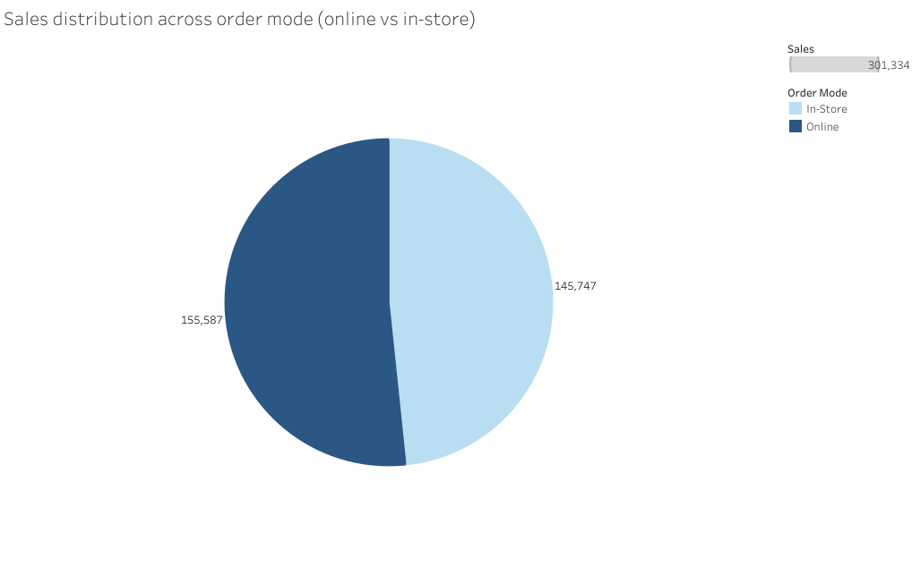

# ACE Retail Sales Performance Report

**Author**: Elena Losavio  
**Date**: July 7, 2025  
**Tools Used**: Python, Tableau Public, GitHub  

---

## Executive Summary

This report presents a comprehensive analysis of ACE Retail’s sales performance across regions, product segments and order channels. Key findings reveal that the East Midlands leads in regional sales, while Kitchen, Outdoor and Electronics dominate segment revenue. High-margin categories such as Grooming and Wearable Tech align with top-selling segments, indicating strong strategic positioning. Online sales outpace in-store transactions, underscoring the importance of digital channels. These insights inform targeted recommendations to optimise pricing, marketing and inventory strategies.

---

## 1 Data Quality Assessment

- **Duplicates removed**  
- **Null discounts**: Filled with zero  
- **Negative discounts**: Corrected to zero  
- **Region and Country**: Validated using reference file  

The dataset was cleaned and standardised to ensure accuracy in the analysis. All discount anomalies were corrected, and geographic fields were verified against a trusted reference.

---

## 2 Regional & Segment Performance

### Regional Sales Overview

| Region                  | Total Sales | Avg Discount Rate |
|------------------------|-------------|-------------------|
| East Midlands          | £53,664     | 16%               |
| Scotland               | £35,253     | 15%               |
| Yorkshire & the Humber | £33,741     | 15%               |
| South East             | £30,538     | 15%               |
| London                 | £30,477     | 15%               |
| South West             | £30,347     | 15%               |
| North West             | £28,559     | 15%               |
| East of England        | £20,867     | 16%               |
| West Midlands          | £20,160     | 15%               |
| Northern Ireland       | £9,215      | 16%               |
| Wales                  | £4,324      | 15%               |
| North East             | £4,189      | 16%               |

 **Insight**:  
East Midlands leads all other regions, worth investigating what drives growth there. North East and Wales underperform significantly, suggesting potential for a marketing push or operational review. Despite higher sales volumes, East Midlands maintains a discount rate in line with national norms, indicating consistent pricing across regions.

---

### Segment Sales Performance

| Rank | Segment             | Total Sales (£) | Avg Discount Rate (%) |
|------|---------------------|------------------|------------------------|
| 1    | Kitchen             | £36,046          | 15.5%                  |
| 2    | Outdoor             | £35,188          | 15.1%                  |
| 3    | Electronics         | £22,269          | 15.7%                  |
| 4    | Health & Hygiene    | £19,877          | 14.8%                  |
| 5    | Home Decor          | £19,774          | 14.3%                  |
| 6    | Food - Snacks       | £19,293          | 14.6%                  |
| 7    | Bedding             | £16,323          | 14.1%                  |
| 8    | Fitness             | £14,082          | 14.9%                  |
| 9    | Office Supplies     | £13,937          | 13.9%                  |
| 10   | Accessories         | £13,820          | 14.2%                  |
| 11   | Food - Breakfast    | £13,294          | 13.7%                  |
| 12   | Technology          | £12,837          | 15.3%                  |
| 13   | Apparel             | £12,398          | 13.5%                  |
| 14   | Personal Care       | £11,221          | 13.2%                  |
| 15   | Pet Supplies        | £10,901          | 14.0%                  |
| 16   | Bags & Travel       | £10,633          | 13.6%                  |
| 17   | Lighting            | £10,126          | 14.4%                  |
| 18   | Stationery          | £9,854           | 13.3%                  |
| 19   | Cleaning Products   | £9,495           | 13.9%                  |
| 20   | Garden & DIY        | £9,164           | 13.8%                  |

 **Insight**:  
Most maintain discount rates between 13% and 16%, indicating consistent promotional strategies. Segments such as Electronics and Technology achieve high sales, suggesting opportunities for revenue optimisation.

---

## 3 Product Performance

### Top 5 Products by Revenue
- Portable Refrigerator Freezer  
- Electric Bike  
- Portable Solar Generator  
- Digital Camera  
- Compact Digital Camera  

### Bottom 5 Products by Revenue
- Baking Soda  
- Sesame Seeds  
- Tomato Paste  
- Flavored Rice Cakes  
- Canned Black Beans  

**Insight**:  
Top products align with high-revenue segments such as Kitchen, Outdoor and Electronics, reflecting strong consumer demand and higher-value purchases. In contrast, the bottom 5 (from segments such as Condiments and Baking Ingredients) suggest limited demand for such products.

---

## 4 Category Profitability

**Margin Calculation**:  
`(Sales - Cost Price) / Sales`

### Top 10 Product Categories by Profit Margin

| Rank | Category         | Profit Margin |
|------|------------------|---------------|
| 1    | Grooming         | 70.36%        |
| 2    | Baby             | 70.19%        |
| 3    | Storage          | 70.14%        |
| 4    | Wearable Tech    | 70.04%        |
| 5    | Home Security    | 69.99%        |
| 6    | Travel           | 69.65%        |
| 7    | Office           | 69.17%        |
| 8    | Home Appliances  | 69.13%        |
| 9    | Books            | 69.08%        |
| 10   | Health           | 68.99%        |

**Insight**:  
The top-performing categories by profit margin (such as Grooming, Baby and Storage) stand out for their strong profitability, likely driven by low production costs or premium pricing. Wearable Tech and Home Security also rank high, reinforcing earlier findings that Electronics and Outdoor segments are not only top revenue drivers but also highly profitable.  
Meanwhile, categories such as Travel and Office, though not top sellers, show strong margins, highlighting untapped potential for growth through targeted campaigns.

---

## 5 Order Channel Distribution

**Sales by Order Mode**:  
A pie chart analysis reveals that online orders outpace in-store purchases by 6.8%.

**Insight**:  
Online orders’ slight dominance indicates a customer preference for convenience and online orders that could be strengthened with investment in digital marketing, e-commerce optimisation and online-exclusive promotions.

---

## Recommendations

Based on the analysis, the following actions are recommended:

1. **Double down on high-performing regions** such as East Midlands, by identifying key drivers.
2. **Optimise pricing strategies** in segments such as Electronics and Technology.
3. **Invest in high-margin categories** such as Grooming and Wearable Tech to maximise profitability.
4. **Reevaluate underperforming products** in Baking Ingredients and Condiments for potential delisting or repositioning.
5. **Enhance digital strategy** to capitalise on online sales, consider targeted ads and UX improvements.

---

## Attachments

- `Elena_Losavio_final_cleaned_sales.csv` 
- `Elena_Losavio_Ace_sales_analysis.py`  
- Visuals: Charts saved in `/visuals/`

